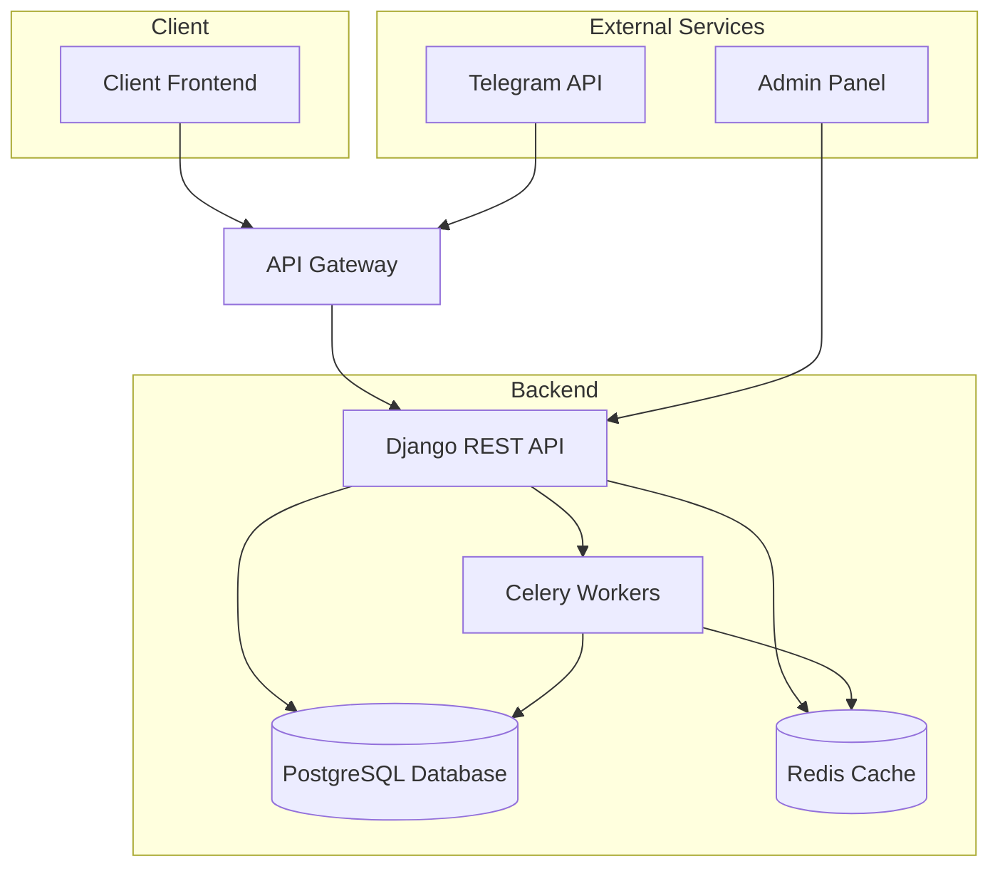
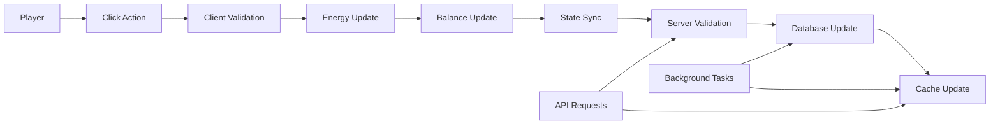

# Clicker Game System Architecture

## Component Diagram



## Data Flow Diagram



## Player Lifecycle

```mermaid
graph TD
    A[Player Registration] --> B[Profile Creation]
    B --> C[Initial State Setup]
    C --> D[Gameplay]
    D --> E[Clicking]
    D --> F[Purchasing Upgrades]
    D --> G[Claiming Rewards]
    D --> H[Completing Tasks]
    E --> I[Energy Management]
    F --> J[State Updates]
    G --> J
    H --> J
    J --> K[Sync with Server]
    K --> L[Validation]
    L --> M[Database Update]
    M --> N[Continue Gameplay]
    
    O[Background Tasks] --> M